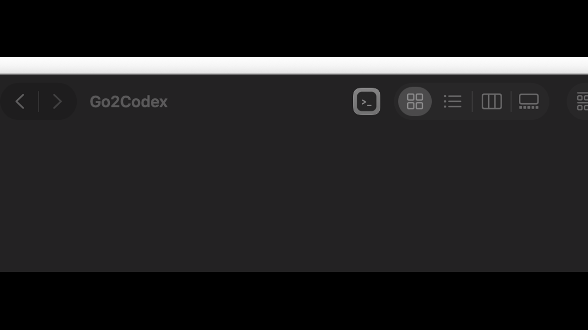
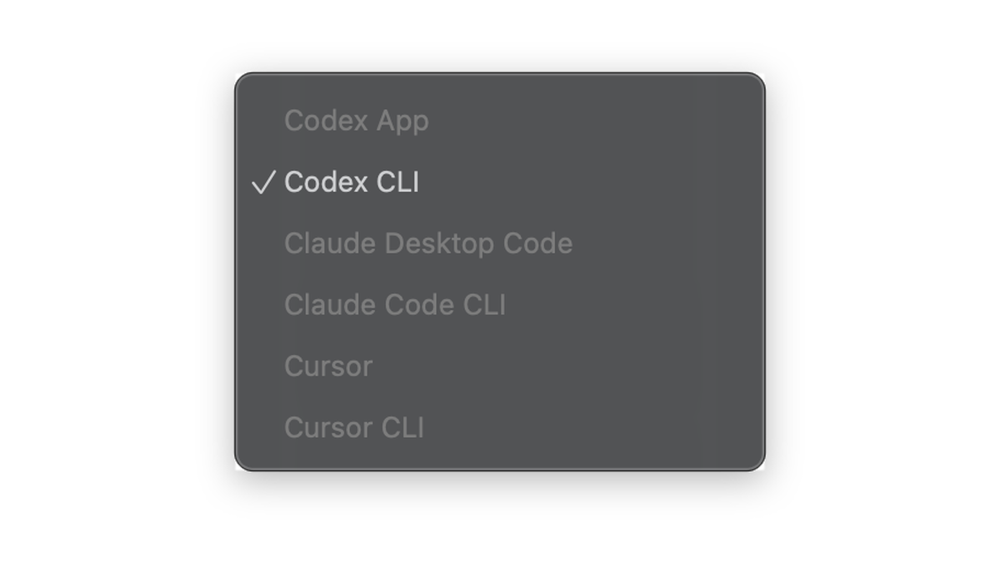
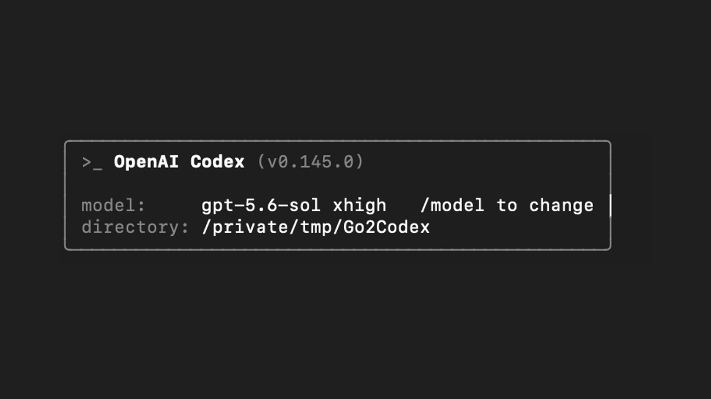
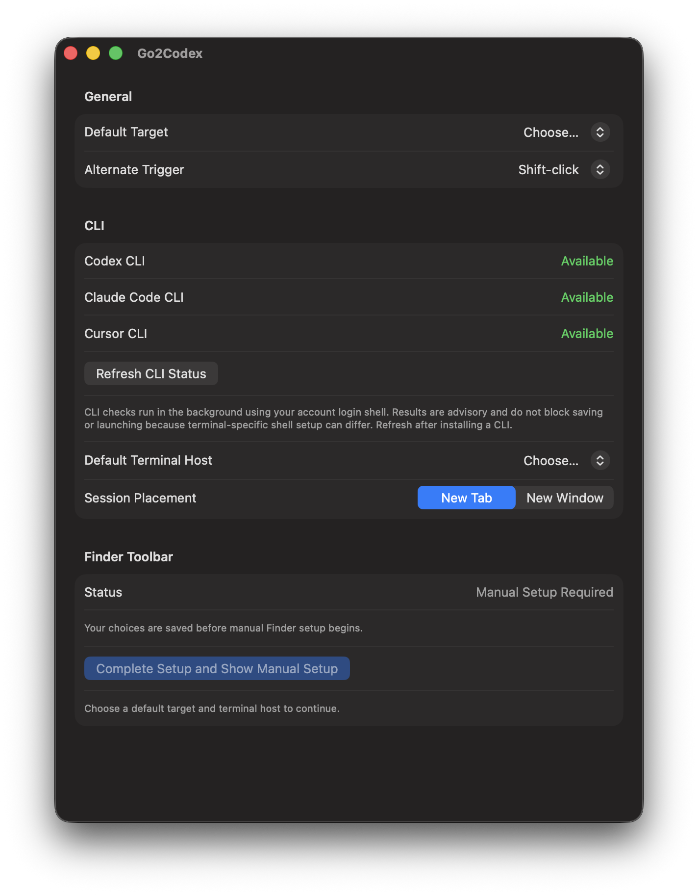

English | [简体中文](README.zh-CN.md)

<!-- readme-section: overview -->

# Go2Codex

Open the folder shown in Finder in Codex, Claude, or Cursor with one toolbar click.

Go2Codex adds one button to the Finder toolbar. It passes the exact folder shown by the frontmost Finder window to Codex App, Codex CLI, Claude Desktop, Claude Code CLI, Cursor, or Cursor CLI. The public package contains one top-level `Go2Codex.app`; its Finder Launcher is embedded inside that app.

[Download the latest stable release](https://github.com/CzRzChao/go2codex/releases/tag/v0.1.1) · [All releases](https://github.com/CzRzChao/go2codex/releases) · [Security policy](SECURITY.md)

> [!WARNING]
> The current public build is ad-hoc signed, not Developer ID signed, and not notarized. A browser-downloaded copy is normally blocked by Gatekeeper on first launch. The GitHub release being marked Stable does not change its Apple signing status.

<!-- readme-section: see-it-in-action -->

## See it in action

These screenshots use the same disposable demo folder from Finder through launch. Select any image to view it at full size.

<table>
  <tr>
    <td width="33%">
      <a href="docs/assets/showcase-finder-toolbar.png"></a>
    </td>
    <td width="33%">
      <a href="docs/assets/showcase-target-picker.png"></a>
    </td>
    <td width="33%">
      <a href="docs/assets/showcase-workspace-open.png"></a>
    </td>
  </tr>
  <tr>
    <td><strong>Click from Finder.</strong><br>Open a folder and click the Go2Codex toolbar button.</td>
    <td><strong>Choose only when needed.</strong><br>Shift-click to select any available target for this launch.</td>
    <td><strong>Keep working.</strong><br>The same folder opens in the selected desktop app or CLI.</td>
  </tr>
</table>

<!-- readme-section: quick-start -->

## Quick start

1. Confirm that your Mac meets the [requirements](#requirements).
2. Download the ZIP and checksum from [the current stable release](https://github.com/CzRzChao/go2codex/releases/tag/v0.1.1), then [verify the download](#download-and-verify).
3. Move `Go2Codex.app` to `/Applications` or `~/Applications` and open it. If macOS blocks it, follow the [Gatekeeper steps](#first-launch-through-gatekeeper).
4. Choose a Default Target, Default Terminal Host, and whether CLI sessions should use a New Tab or New Window. If iTerm2 is not installed, choose Terminal.
5. Choose **Complete Setup and Install in Finder**. If automatic setup is unavailable, choose **Complete Setup and Show Manual Setup** and follow the Command-drag instructions.
6. Open a regular folder in Finder and click the Go2Codex toolbar button. For a different target on that launch, Shift-click and keep Shift held until the Target Picker appears.

The Settings window itself does not request Automation access. The first real toolbar launch asks for Finder Automation access; the first CLI launch also asks for Terminal or iTerm2 Automation access.

<!-- readme-section: requirements -->

## Requirements

- An **Apple Silicon** Mac. Intel and Universal builds are not published.
- **macOS 14 Sonoma** or later.
- At least one supported coding agent already installed:
  - Codex App, Claude Desktop, or Cursor for a desktop target; and/or
  - `codex`, `claude`, or `cursor-agent` available in your shell for a CLI target.
- Terminal.app or iTerm2 for CLI targets. iTerm2 works with **zsh**, **bash**, or **fish** as the account login shell.

Go2Codex does not install or bundle Codex, Claude, Cursor, their CLIs, or iTerm2. Install the targets you want separately before using them. Xcode and a paid Apple Developer account are not required to use the prebuilt release.

<!-- readme-section: download-and-gatekeeper -->

## Download, checksum, and Gatekeeper

### Download and verify

Download the ZIP and its checksum file from [the current stable GitHub Release](https://github.com/CzRzChao/go2codex/releases/tag/v0.1.1) into the same directory:

- `Go2Codex-0.1.1-macos-arm64.zip`
- `Go2Codex-0.1.1-macos-arm64.zip.sha256`

Verify before extracting:

```sh
shasum -a 256 -c Go2Codex-0.1.1-macos-arm64.zip.sha256
```

Continue only if the command reports `OK` and you trust this repository. Preview releases are optional early-testing builds and do not replace the stable release.

### First launch through Gatekeeper

Before the first launch, move the app to `/Applications` or `~/Applications`. Running it directly from Downloads can place it in a temporary location where Go2Codex cannot install the Finder toolbar button.

Public stable and preview builds are ad-hoc signed but are **not Developer ID signed or notarized**. A quarantined browser download may show “Apple could not verify” or recommend moving the app to Trash.

After the first blocked launch:

1. Open **System Settings** → **Privacy & Security**.
2. Scroll to **Security** and choose **Open Anyway** for Go2Codex.
3. Authenticate and confirm **Open**.

Do not remove the quarantine attribute merely to bypass this review. The Open Anyway option may be unavailable on an organization-managed Mac. See [SECURITY.md](SECURITY.md) for the application’s security posture.

<!-- readme-section: finder-toolbar -->

## Finder toolbar setup

The public package has one searchable `Go2Codex.app`. Its toolbar Launcher lives at `Go2Codex.app/Contents/Helpers`, so no second top-level app needs to be installed.

### Automatic setup

1. Put `Go2Codex.app` in `/Applications` or `~/Applications`.
2. Complete the settings shown on first launch.
3. Choose **Complete Setup and Install in Finder** or, after initial setup, **Install in Finder**.
4. Review the warning and confirm **Install and Restart Finder**. Finder briefly restarts.

Automatic install, repair, and removal are experimental. They change the current user’s private Finder toolbar setting and restart Finder after confirmation. Unrelated toolbar items are preserved. Choose manual setup if you prefer not to use the automatic method.

Automatic setup is currently enabled only for these tested combinations:

- macOS build `23G80` with Finder `14.6 (1632.6.3)`
- macOS build `25F84` with Finder `26.4 (1828.5.2)`

A different macOS or Finder version normally uses manual setup instead. This does not mean the app itself failed to install.

### Manual setup

1. Save your choices during first-run setup:
   - if Settings shows **Complete Setup and Show Manual Setup**, choose it; or
   - if it shows only **Complete Setup and Install in Finder** and you prefer manual setup, choose it to save your settings, then choose **Cancel** in the automatic-install confirmation.
2. Reveal the embedded Launcher:
   - in the manual instructions, or from **Show Manual Setup** after first-run setup, choose **Show in Finder**; or
   - find the installed `Go2Codex.app` in `/Applications` or `~/Applications`, right-click it, choose **Show Package Contents**, and open `Contents/Helpers`.
3. If an old Go2Codex button is present, hold Command (⌘) and drag it out of the toolbar.
4. Hold Command (⌘) and drag `Go2CodexLauncher.app` into the Finder toolbar.

Manual setup lets Finder save its own toolbar change, does not restart Finder, and works on unsupported Finder versions.

<!-- readme-section: targets-and-terminal -->

## Targets and terminal configuration

<p align="center">
  
</p>

| Target | What Go2Codex opens | Terminal |
| --- | --- | --- |
| Codex App | The folder in Codex App | Not used |
| Codex CLI | Codex CLI in the folder | Terminal.app or iTerm2 |
| Claude Desktop Code | The folder in Claude Desktop | Not used |
| Claude Code CLI | Claude Code CLI in the folder | Terminal.app or iTerm2 |
| Cursor | The folder in Cursor | Not used |
| Cursor CLI | Cursor Agent (`cursor-agent`) in the folder | Terminal.app or iTerm2 |

Settings marks desktop apps and iTerm2 as unavailable when they are not installed. If iTerm2 cannot be selected, choose Terminal and continue. Desktop targets do not use the Terminal setting. First-run setup still requires a terminal choice; it is used only when you launch a CLI target.

When you launch Cursor, Go2Codex hands the folder to Cursor. Cursor’s own settings decide whether it reuses an existing window or opens a new one.

### CLI status

Settings checks `codex`, `claude`, and `cursor-agent` in the background without opening a terminal window. Your zsh, bash, or fish startup files may run during this short check.

| Status | Meaning |
| --- | --- |
| **Available** | Go2Codex found the CLI. |
| **Not Found** | Install the CLI or update `PATH`, then choose **Refresh CLI Status**. |
| **Couldn’t Verify** | Go2Codex could not confirm whether the CLI is available. This does not necessarily mean it is absent. |

These statuses do not block saving or launching because Terminal or iTerm2 may use a different shell configuration. If needed, check from the terminal you plan to use:

```sh
command -v codex
command -v claude
command -v cursor-agent
```

### New Tab or New Window

- **New Tab** asks the selected terminal for a new tab. Terminal may natively fall back to a new window when no suitable window exists.
- **New Window** asks for a separate window.
- Both placements are supported for Codex CLI, Claude Code CLI, and Cursor CLI in Terminal.app and iTerm2.

Go2Codex never retries a failed or uncertain terminal handoff automatically. Depending on when the handoff stopped, an empty session may remain or the CLI may already be running. Check the selected terminal before retrying.

<!-- readme-section: usage -->

## Usage

- **Click** the Finder toolbar button for Quick Launch into the Default Target.
- **Shift-click** for the Target Picker. Keep Shift held until the picker is visible. The Alternate Trigger can also be disabled in Settings.

The **Workspace** is the actual folder shown by the frontmost Finder window. Go2Codex does not use Finder’s selected items, infer a Git root, or substitute another directory when the location cannot be resolved. A real Home or Desktop folder is valid when Finder is actually showing it; virtual locations such as Recents are not.

<!-- readme-section: update-and-uninstall -->

## Updating and fully uninstalling

### Update

Go2Codex does not update itself. To install a newer release:

1. Download and verify the new ZIP and checksum.
2. Quit Go2Codex and replace the existing app in `/Applications` or `~/Applications`.
3. Open the replacement and complete any new Gatekeeper prompt.
4. Check **Finder Toolbar** in Settings:
   - choose **Repair in Finder** if it appears; or
   - for a manual installation, Command-drag the old button out and add the current embedded Launcher again.
5. Launch one target you actually use. If macOS requests Finder, Terminal, or iTerm2 Automation access again, review and grant it then.

Because public builds are ad-hoc signed, macOS may ask for Finder, Terminal, or iTerm2 Automation access again after an update.

### Full uninstall

1. Remove the toolbar button before deleting the app:
   - choose **Uninstall from Finder** when automatic removal is available; or
   - otherwise hold Command (⌘) and drag the existing Go2Codex button out of the Finder toolbar.
2. Confirm the button is gone, quit Go2Codex, and move `Go2Codex.app` from Applications to Trash.
3. Optional preference cleanup:

   ```sh
   defaults delete io.github.czrzchao.go2codex
   ```

4. Optional recovery-data cleanup: in Finder choose **Go** → **Go to Folder…**, enter `~/Library/Application Support/io.github.czrzchao.go2codex`, and move that folder to Trash. Do this only after toolbar removal is confirmed, because the folder can contain the recovery journal.
5. Optional Automation cleanup:

   ```sh
   tccutil reset AppleEvents io.github.czrzchao.go2codex
   ```

The **Reset Settings** action appears only when saved settings need recovery. It is not a general uninstaller and does not remove the Finder button, app, recovery data, or Automation permissions.

<!-- readme-section: troubleshooting -->

## Troubleshooting

### Automation was denied, or no permission prompt appeared

Permission is requested on demand, not while viewing Settings or installing the toolbar button. First click the Finder toolbar button; a CLI target requests terminal access only when it is actually launched.

If a launch fails, choose **Open Automation Settings** in the error dialog, or open **System Settings** → **Privacy & Security** → **Automation** manually. Under Go2Codex, enable Finder and the terminal you selected. Go2Codex does **not** require Accessibility, Full Disk Access, Screen Recording, or Notifications.

If the entry is missing or a previous denial is stuck, quit Go2Codex, run the following scoped reset, reopen the app, and trigger the launch again:

```sh
tccutil reset AppleEvents io.github.czrzchao.go2codex
```

### Finder toolbar setup failed

If automatic setup is unavailable, follow the [manual setup](#manual-setup) instructions shown by Settings.

If you prefer manual setup, or an automatic action fails while Settings continues to show Install or Repair, use the package-contents path in [Manual setup](#manual-setup).

### Finder reports that the location is not a folder

Open a regular, accessible folder in Finder and try again. Recents, search results, Smart Folders, and other virtual views cannot be used as a Workspace. Go2Codex also fails safely when Finder has no open window.

### CLI shows Not Found or Couldn’t Verify

Run `command -v codex`, `command -v claude`, or `command -v cursor-agent` in the terminal profile you intend to use. Install or repair the CLI’s `PATH`, then choose **Refresh CLI Status**. These advisory states never block saving or launching.

### Terminal leaves an empty tab or window

Go2Codex did not submit the CLI command because it could not safely confirm that the new session was ready and uniquely identify it. Close the empty session, wait for Terminal to finish other window or tab changes, and try again. If New Tab repeatedly fails, select New Window in Settings. Do not create, close, reorder, or move Terminal tabs or windows during the brief handoff.

If another Go2Codex Terminal handoff is already running, wait for it to finish before retrying.

### iTerm2 reports an unknown outcome

iTerm2 may already have created the requested session even though Go2Codex did not receive a conclusive reply. Check iTerm2 before retrying to avoid creating a duplicate session.

### Titles change while a CLI starts

Terminal and iTerm2 control their own titles. A title can change while the login shell initializes and the foreground process changes to Codex, Claude, or Cursor Agent; this does not mean Go2Codex is repeatedly submitting the command.

### Report a problem

Use **Copy Diagnostics** in the error dialog and attach the redacted record to a [GitHub issue](https://github.com/CzRzChao/go2codex/issues). Release diagnostics omit the complete Workspace path and generated command. Report suspected vulnerabilities privately through a [GitHub Security Advisory](https://github.com/CzRzChao/go2codex/security/advisories/new), as described in [SECURITY.md](SECURITY.md).

<!-- readme-section: known-limitations -->

## Known limitations

- **Option-click is not supported.** Finder reserves it and may close the source window. Use Shift-click or disable the Alternate Trigger.
- **Automatic Finder setup is version-specific.** Untested Finder versions use manual setup.
- **A failed automatic Finder action may not expose the manual shortcut immediately.** Use the package-contents fallback in [Troubleshooting](#finder-toolbar-setup-failed).
- **Go2Codex itself is local-only.** It makes no network requests and has no telemetry, crash reporting, or background monitoring. The coding agents and terminals it opens are separate software with their own behavior.

<!-- readme-section: license -->

## License

[MIT](LICENSE).
