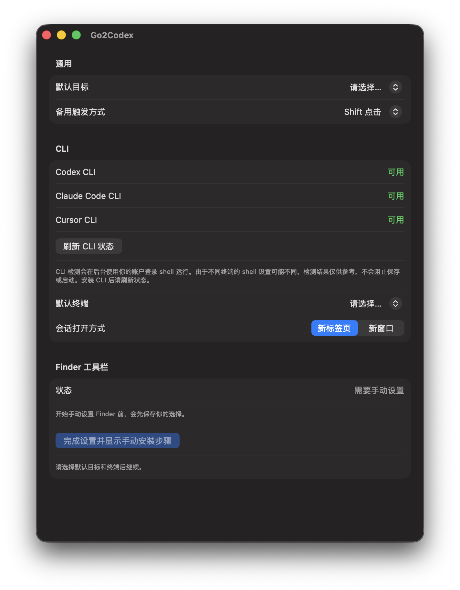

[English](README.md) | 简体中文

<!-- readme-section: overview -->

# Go2Codex

只需点击一次 Finder 工具栏按钮，即可在 Codex、Claude 或 Cursor 中打开当前文件夹。

Go2Codex 会向 Finder 工具栏添加一个按钮，把 Finder 最前方窗口实际显示的文件夹交给 Codex App、Codex CLI、Claude Desktop、Claude Code CLI、Cursor 或 Cursor CLI。公开发布包只有一个顶层 `Go2Codex.app`；Finder 使用的 Launcher 内嵌在这个 App 中。

[下载最新稳定版](https://github.com/CzRzChao/go2codex/releases/tag/v0.2.0) · [全部版本](https://github.com/CzRzChao/go2codex/releases) · [安全策略](SECURITY.md)

> [!WARNING]
> 当前公开构建使用 ad-hoc 签名，没有 Developer ID 签名，也未经过 Apple 公证。通过浏览器下载的副本，首次启动时通常会被 Gatekeeper 阻止。GitHub Release 标记为 Stable 并不改变它的 Apple 签名状态。

<!-- readme-section: see-it-in-action -->

## 效果展示

下面三张图使用同一个临时演示文件夹，完整展示了从 Finder 到启动目标的过程。点击任意图片可以查看原图。

<table>
  <tr>
    <td width="33%">
      <a href="docs/assets/showcase-finder-toolbar.png"></a>
    </td>
    <td width="33%">
      <a href="docs/assets/showcase-target-picker.png"></a>
    </td>
    <td width="33%">
      <a href="docs/assets/showcase-workspace-open.png"></a>
    </td>
  </tr>
  <tr>
    <td><strong>从 Finder 启动。</strong><br>打开一个文件夹，点击 Go2Codex 工具栏按钮。</td>
    <td><strong>按需选择目标。</strong><br>按住 Shift 点击，为本次启动选择任一可用目标。</td>
    <td><strong>直接继续工作。</strong><br>同一个文件夹会在所选桌面 App 或 CLI 中打开。</td>
  </tr>
</table>

<!-- readme-section: quick-start -->

## 快速开始

1. 确认 Mac 符合[系统要求](#系统要求)。
2. 从[当前稳定版](https://github.com/CzRzChao/go2codex/releases/tag/v0.2.0)下载 ZIP 和校验文件，然后按照[下载并校验](#下载并校验)中的步骤完成校验。
3. 把 `Go2Codex.app` 移到 `/Applications` 或 `~/Applications`，然后打开 App。如果 macOS 阻止启动，请按照[首次启动与 Gatekeeper](#首次启动与-gatekeeper)中的步骤操作。
4. 选择默认目标、默认终端，以及 CLI 会话使用新标签页还是新窗口。如果没有安装 iTerm2，请选择 Terminal。
5. 点击**完成设置并安装到 Finder**。如果自动设置不可用，请点击**完成设置并显示手动安装步骤**，然后按照 Command 拖入说明操作。
6. 在 Finder 中打开一个普通文件夹，点击 Go2Codex 工具栏按钮。如果这次想临时选择其他目标，请在 Shift 点击时持续按住 Shift，直到目标选择器出现。

仅仅打开设置窗口不会触发“自动化”授权。第一次实际使用工具栏启动时会请求 Finder 自动化权限；第一次启动 CLI 时还会请求 Terminal 或 iTerm2 自动化权限。

<!-- readme-section: requirements -->

## 系统要求

- **Apple 芯片** Mac。目前不发布 Intel 或 Universal 构建。
- **macOS 14 Sonoma** 或更高版本。
- 已经安装至少一个受支持的编程 Agent：
  - 桌面目标需要 Codex App、Claude Desktop 或 Cursor；和/或
  - CLI 目标需要 shell 中可以找到 `codex`、`claude` 或 `cursor-agent`。
- CLI 目标需要 Terminal.app 或 iTerm2。iTerm2 支持使用 **zsh**、**bash** 或 **fish** 作为账户登录 shell。

Go2Codex 不会安装或捆绑 Codex、Claude、Cursor、它们的 CLI 或 iTerm2。请先单独安装你希望使用的目标。使用预构建发布包不需要 Xcode，也不需要付费 Apple Developer 账号。

<!-- readme-section: download-and-gatekeeper -->

## 下载、校验与 Gatekeeper

### 下载并校验

请从[当前稳定版 GitHub Release](https://github.com/CzRzChao/go2codex/releases/tag/v0.2.0)下载 ZIP 和校验文件，并把它们放在同一个目录：

- `Go2Codex-0.2.0-macos-arm64.zip`
- `Go2Codex-0.2.0-macos-arm64.zip.sha256`

解压前先校验：

```sh
shasum -a 256 -c Go2Codex-0.2.0-macos-arm64.zip.sha256
```

只有命令输出 `OK` 并且你信任此仓库时才应继续。预览版是可选的提前测试版本，不会替代稳定版。

### 首次启动与 Gatekeeper

第一次启动前，请先把 App 移到 `/Applications` 或 `~/Applications`。直接从“下载”目录运行可能会让 App 位于临时位置，导致 Go2Codex 无法安装 Finder 工具栏按钮。

公开的稳定版和预览版使用 ad-hoc 签名，但**没有 Developer ID 签名，也未经过 Apple 公证**。带有浏览器下载隔离标记的副本可能显示“Apple 无法验证”，或者建议把 App 移到废纸篓。

第一次启动被阻止后：

1. 打开**系统设置** → **隐私与安全性**。
2. 滚动到**安全性**，为 Go2Codex 选择**仍要打开**。
3. 完成身份验证并确认**打开**。

不要仅仅为了绕过这一步而删除隔离属性。由组织管理的 Mac 可能不允许“仍要打开”。应用的安全边界见 [SECURITY.md](SECURITY.md)。

<!-- readme-section: finder-toolbar -->

## 安装 Finder 工具栏按钮

公开发布包只有一个可搜索的 `Go2Codex.app`。工具栏 Launcher 位于 `Go2Codex.app/Contents/Helpers`，不需要再安装第二个顶层 App。

### 自动设置

1. 把 `Go2Codex.app` 放到 `/Applications` 或 `~/Applications`。
2. 完成首次启动时显示的设置。
3. 点击**完成设置并安装到 Finder**；如果已经完成首次设置，则点击**安装到 Finder**。
4. 阅读警告并确认**安装并重启 Finder**。Finder 会短暂重启。

自动安装、修复和移除属于实验性功能。确认后，它们会修改当前用户的 Finder 私有工具栏设置并重启 Finder，同时保留无关的工具栏项目。如果不希望使用自动方式，请选择手动设置。

自动设置目前只对以下已测试组合开放：

- macOS build `23G80`，Finder `14.6 (1632.6.3)`
- macOS build `25F84`，Finder `26.4 (1828.5.2)`

其他 macOS 或 Finder 版本通常会改用手动设置。这不表示 App 本身安装失败。

### 手动设置

1. 首次设置时先保存你的选择：
   - 如果设置页显示**完成设置并显示手动安装步骤**，请点击它；或者
   - 如果只显示**完成设置并安装到 Finder**，但你希望手动设置，请先点击它保存设置，再在随后出现的自动安装确认窗口中点击**取消**。
2. 显示内嵌 Launcher：
   - 在手动说明中，或者首次设置完成后通过**显示手动安装步骤**，点击**在 Finder 中显示**；或者
   - 在 `/Applications` 或 `~/Applications` 中找到已经安装的 `Go2Codex.app`，右键点击它，选择**显示包内容**，再打开 `Contents/Helpers`。
3. 如果工具栏中已经有旧的 Go2Codex 按钮，请按住 Command (⌘) 并把它拖出工具栏。
4. 按住 Command (⌘)，把 `Go2CodexLauncher.app` 拖入 Finder 工具栏。

手动方式由 Finder 自己保存工具栏变更，不会重启 Finder，也可以用于尚未支持的 Finder 版本。

<!-- readme-section: targets-and-terminal -->

## 目标与终端配置

<p align="center">
  
</p>

| 目标 | Go2Codex 会打开什么 | 终端 |
| --- | --- | --- |
| Codex App | 在 Codex App 中打开文件夹 | 不使用 |
| Codex CLI | 在文件夹中启动 Codex CLI | Terminal.app 或 iTerm2 |
| Claude Desktop Code | 在 Claude Desktop 中打开文件夹 | 不使用 |
| Claude Code CLI | 在文件夹中启动 Claude Code CLI | Terminal.app 或 iTerm2 |
| Cursor | 在 Cursor 项目（IDE）窗口中打开文件夹 | 不使用 |
| Cursor CLI | 在文件夹中启动 Cursor Agent（`cursor-agent`） | Terminal.app 或 iTerm2 |

没有安装的桌面 App 和 iTerm2 会在设置页中显示为不可用。如果无法选择 iTerm2，请改选 Terminal 后继续。桌面目标不会使用终端设置，但首次设置仍要求选择一个终端；只有启动 CLI 目标时才会使用它。

启动 Cursor 时，Go2Codex 会在 Cursor 项目（IDE）窗口中打开 Finder 当前显示的精确文件夹。目前不支持 Cursor Agents Window，因为 Cursor 没有提供可以通过指定本地文件夹打开它的稳定公开接口。Go2Codex 不使用 Cursor 的私有接口或仅供开发使用的接口。

### CLI 状态

设置页会在后台检测 `codex`、`claude` 和 `cursor-agent`，不会打开终端窗口。短暂检测期间可能会运行你的 zsh、bash 或 fish 启动文件。

| 状态 | 含义 |
| --- | --- |
| **可用** | Go2Codex 找到了这个 CLI。 |
| **未找到** | 安装 CLI 或调整 `PATH` 后，点击**刷新 CLI 状态**。 |
| **无法验证** | Go2Codex 无法确认 CLI 是否可用；这不一定表示 CLI 没有安装。 |

这些状态不会阻止保存或启动，因为 Terminal 或 iTerm2 可能使用不同的 shell 配置。必要时，请在准备使用的终端中检查：

```sh
command -v codex
command -v claude
command -v cursor-agent
```

### 新标签页或新窗口

- **新标签页**会请求所选终端创建一个新标签页。如果没有合适的窗口，Terminal 可能原生回退为新建窗口。
- **新窗口**会请求创建一个独立窗口。
- Terminal.app 和 iTerm2 中的 Codex CLI、Claude Code CLI、Cursor CLI 都支持这两种方式。

Go2Codex 不会自动重试失败或结果不确定的终端交接。根据操作停止的时机，可能会留下空会话，也可能 CLI 已经启动。重试前请先检查所选终端。

<!-- readme-section: usage -->

## 使用方式

- **点击** Finder 工具栏按钮：使用默认目标快速启动。
- **Shift 点击**：打开目标选择器。请持续按住 Shift，直到选择器出现。也可以在设置中禁用备用触发方式。

**工作目录**始终是 Finder 最前方窗口实际显示的文件夹。Go2Codex 不会使用 Finder 当前选中的项目、推断 Git 根目录，也不会在无法解析位置时替换成其他目录。如果 Finder 实际显示的是 Home 或 Desktop 文件夹，它们可以正常使用；“最近使用”等虚拟位置则不行。

<!-- readme-section: update-and-uninstall -->

## 更新与完整卸载

### 更新

Go2Codex 不会自动更新。安装新版本时：

1. 下载并校验新版 ZIP 和校验文件。
2. 退出 Go2Codex，替换 `/Applications` 或 `~/Applications` 中已有的 App。
3. 打开新版，并完成可能再次出现的 Gatekeeper 提示。
4. 检查设置中的 **Finder 工具栏**状态：
   - 如果显示**在 Finder 中修复**，请执行修复；或者
   - 如果之前是手动安装，请按住 Command 把旧按钮拖出，再添加当前内嵌 Launcher。
5. 实际启动一次你会使用的目标。如果 macOS 再次请求 Finder、Terminal 或 iTerm2 自动化权限，请在这时检查并授权。

由于公开构建使用 ad-hoc 签名，更新后 macOS 可能会再次请求 Finder、Terminal 或 iTerm2 自动化权限。

### 完整卸载

1. 删除 App 前，先移除工具栏按钮：
   - 自动移除可用时，点击**从 Finder 卸载**；或者
   - 否则按住 Command (⌘)，直接把现有的 Go2Codex 按钮拖出 Finder 工具栏。
2. 确认按钮已经消失，退出 Go2Codex，再把“应用程序”中的 `Go2Codex.app` 移到废纸篓。
3. 可选：清理偏好设置。

   ```sh
   defaults delete io.github.czrzchao.go2codex
   ```

4. 可选：清理恢复数据。在 Finder 中选择**前往** → **前往文件夹…**，输入 `~/Library/Application Support/io.github.czrzchao.go2codex`，把这个文件夹移到废纸篓。请只在确认工具栏按钮已经移除后操作，因为这里可能包含恢复日志。
5. 可选：清理自动化授权。

   ```sh
   tccutil reset AppleEvents io.github.czrzchao.go2codex
   ```

**重置设置**仅会在保存的设置需要恢复时出现。它不是通用卸载入口，也不会移除 Finder 按钮、App、恢复数据或自动化权限。

<!-- readme-section: troubleshooting -->

## 故障排查

### 自动化权限被拒绝，或者没有出现授权窗口

权限是按需请求的，不会在浏览设置页或安装工具栏按钮时出现。请先实际点击 Finder 工具栏按钮；只有真正启动 CLI 目标时，才会请求终端访问权限。

如果启动失败，请在错误窗口中点击**打开“自动化”设置**，或者手动打开**系统设置** → **隐私与安全性** → **自动化**。在 Go2Codex 下启用 Finder 和所选终端。Go2Codex **不需要**辅助功能、完全磁盘访问权限、屏幕录制或通知权限。

如果没有 Go2Codex 条目，或之前的拒绝状态无法恢复，请退出 Go2Codex，执行下面这个限定范围的重置命令，重新打开 App 后再触发一次启动：

```sh
tccutil reset AppleEvents io.github.czrzchao.go2codex
```

### Finder 工具栏设置失败

如果自动设置不可用，请按照设置页显示的[手动设置](#手动设置)说明操作。

如果你希望主动使用手动方式，或者自动操作失败但设置页仍然显示“安装”或“修复”，请使用[手动设置](#手动设置)中的“显示包内容”方式。

### Finder 提示当前位置不是文件夹

请在 Finder 中打开一个普通且可访问的文件夹后重试。“最近使用”、搜索结果、智能文件夹和其他虚拟视图不能作为工作目录。Finder 没有打开窗口时，Go2Codex 也会安全失败。

### CLI 显示“未找到”或“无法验证”

请在准备使用的终端 profile 中运行 `command -v codex`、`command -v claude` 或 `command -v cursor-agent`。安装 CLI 或修复它的 `PATH` 后，点击**刷新 CLI 状态**。这些状态只供参考，不会阻止保存或启动。

### Terminal 留下空标签页或空窗口

Go2Codex 因为无法安全确认新会话已经就绪并且可以被唯一定位，所以没有提交 CLI 命令。请关闭空会话，等待 Terminal 完成其他窗口或标签页变化后重试。如果新标签页持续失败，请在设置中改选新窗口。短暂交接期间，请不要创建、关闭、重排或移动 Terminal 标签页和窗口。

如果另一个 Go2Codex Terminal 交接正在进行，请等待它结束后再重试。

### iTerm2 提示结果无法确定

iTerm2 可能已经创建了请求的会话，但 Go2Codex 没有收到确定的回复。请先检查 iTerm2，再决定是否重试，避免创建重复会话。

### CLI 启动时标题不断变化

Terminal 和 iTerm2 控制自己的标题。登录 shell 初始化，以及前台进程切换到 Codex、Claude 或 Cursor Agent 时，标题可能发生变化；这不表示 Go2Codex 在重复提交命令。

### 报告问题

请在错误窗口中使用**复制诊断信息**，把脱敏后的记录附到 [GitHub Issue](https://github.com/CzRzChao/go2codex/issues)。Release 诊断不会包含完整工作目录路径或生成的命令。疑似安全漏洞请按照 [SECURITY.md](SECURITY.md) 的说明，通过 [GitHub Security Advisory](https://github.com/CzRzChao/go2codex/security/advisories/new) 私下报告。

<!-- readme-section: known-limitations -->

## 已知限制

- **不支持 Option 点击。** Finder 会保留这个操作，并且可能关闭来源窗口。请使用 Shift 点击，或禁用备用触发方式。
- **Finder 自动设置依赖具体版本。** 尚未测试的 Finder 版本会使用手动设置。
- **自动 Finder 操作失败后，设置页可能不会立即提供手动入口。** 请使用[故障排查](#finder-工具栏设置失败)中的“显示包内容”回退方式。
- **Go2Codex 本身仅在本地运行。** 它不会发起网络请求，也没有遥测、崩溃上报或后台监控。它打开的编程 Agent 和终端属于其他软件，有各自的行为。

<!-- readme-section: license -->

## 许可证

[MIT](LICENSE)。
